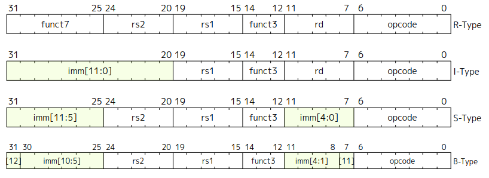
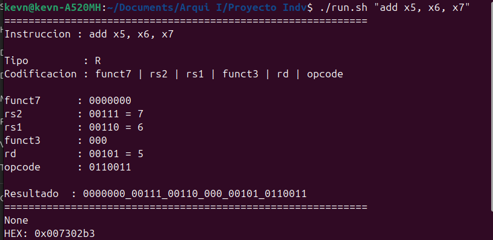
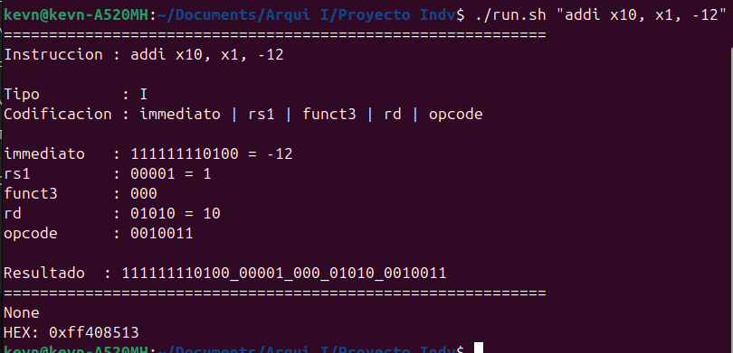
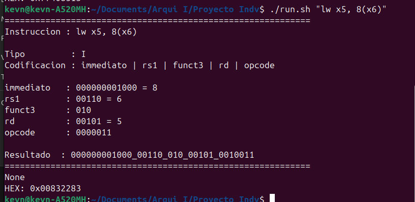
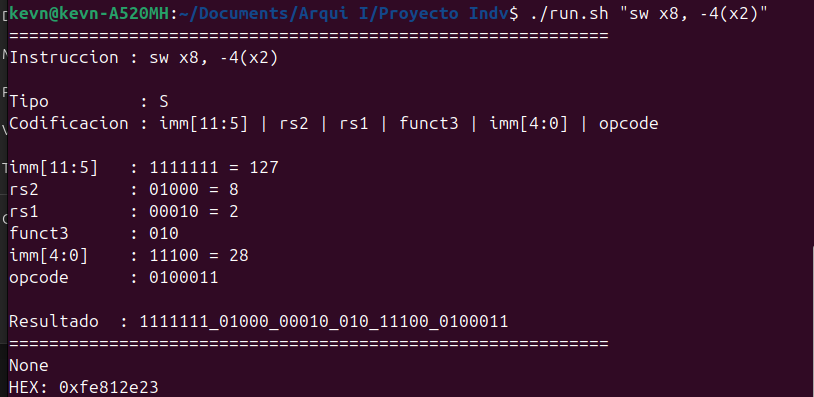
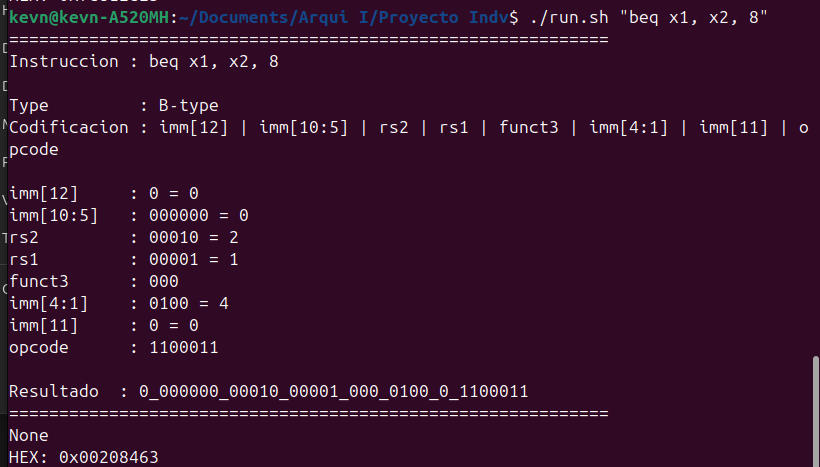
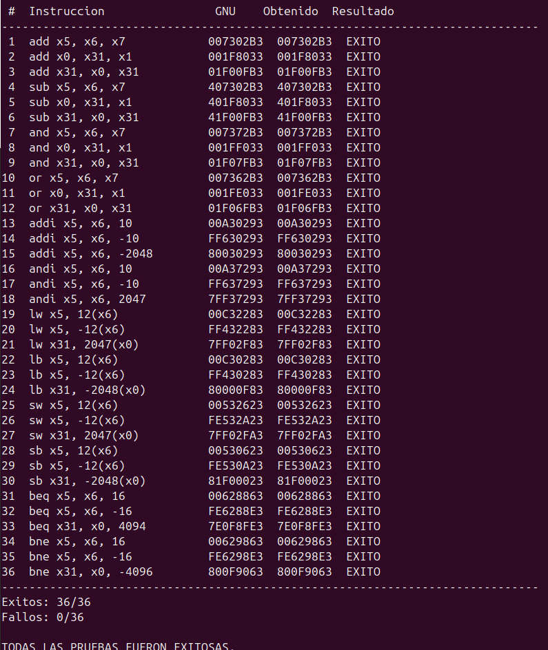

# Proyecto Individual

La traducción de las instrucciones a una secuencia de bits que es un proceso fundamental en la arquitectura de computadores, debido a que estas secuencias son las que finalmente van a ser ejecutadas por el procesador, este lee distintos campos de la secuencia, definiendo así el comportamiento del hardware para realizar de manera correcta la instrucción deseada. Con el fin de familiarizarse con este proceso, se desrrolla una aplicación que recibe instrucciones en lenguaje ensamblador, en este caso un subconjunto de instrucciones RV32I, y realiza la codificación correspondiente, así como mostrar una explicación de las diferentes partes del resultado final.

## Arquitectura del código
RV32I cuenta con diferentes instrucciones, que son clasificadas por su tipo, cada tipo cuenta con su propia codificación, por lo que primero se debe identificar el tipo de la instrucción según su mnemónico, una vez se conoce el tipo, se pueden analizar los operandos para obtener la codificación final. Debido a esto, se cuenta con una función principal, que encuentra el tipo de instrucción y varias funciones que realizan la codificación para cada tipo. Además se tienen funciones que se utilizan en varios tipos de instrucciones, para obtener los registros y verificar que sean válidos o para el manejo del inmediato, que debe ser de un tamaño específico para que se pueda almacenar en la cantidad de bits que permita la instrucción, además de ser dividido según requiera la codificación de la instrucción.

## Codficicación de las instrucciones
Para poder realizar la codificación se debe conocer la convención utilizada por RV32I para la codificaión de cada tipo la cual, según [1] es la siguiente:



## Ejemplos de Salida explicativa
A continuación, se pueden observar algunas explaciones obtenidas con instrucciones de diferentes tipos, estas se pueden compararan con la codficación esperada de la figura 1.

### Explicación de Instrucción tipo R



### Explicación de Instrucciones tipo I





### Explicación de Instrucción tipo S



### Explicación de Instrucción tipo B



## Validación contra RISC-V GNU Toolchain
Además se utilizó una herramienta de ensamblado y un `objdump`, para obtener las instrucciónes y su codificación. Estas fueron verificadas automáticamente mediante un script de prueba, obtieniendo los siguientes resultados:



## Instalación del toolchain

La herramienta utilizada para la valdación es **RISC-V GNU de 64 bits**:

```text
riscv64-unknown-elf-as
riscv64-unknown-elf-objdump
```

Para ensamblar RV32I se debe utilizar el comando:

```text
-march=rv32i
```

Primero se debe verifacar la instalación:

```bash
riscv64-unknown-elf-as --version
```

y:

```bash
riscv64-unknown-elf-objdump --version
```

Si no se encuentran instaladas, se debe utilizar los comandos:

``bash
sudo apt install gcc-riscv64-unknown-elf
```
y:

``bash
sudo apt install binutils-riscv64-unknown-elf
```

## Referencias
[1] Andrew Waterman and Krste Asanović. *The RISC-V Instruction Set Manual, Volume I: User-Level ISA, Document Version 20191213*. RISC-V Foundation, 2019.